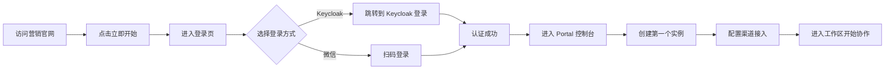
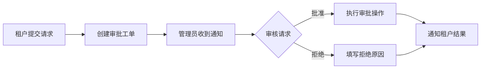

# OpenClaw 云平台前端需求手册

## 1. 产品概述
OpenClaw 云平台是一个企业级实例管理和协作平台，提供统一的多渠道接入、双控制台架构和原生 OpenClaw 实例运行环境。

### 核心目标
- 为企业用户提供便捷的 OpenClaw 实例部署和管理界面
- 通过双控制台架构区分租户用户和平台管理员的职责
- 统一接入飞书、企微、钉钉、Slack 等主流协作渠道
- 保留 OpenClaw 原生调试能力的同时，提供企业级安全保障

### 目标用户
- 企业租户用户：使用 OpenClaw 实例进行业务协作
- 平台管理员：管理租户、实例和渠道接入
- 技术运维：监控实例运行状态和进行故障排查

---

## 2. 核心功能

### 2.1 用户角色

| 角色 | 注册方式 | 核心权限 |
|------|----------|----------|
| 租户用户 | Keycloak SSO/微信登录 | 实例管理、渠道配置、工作区协作、工单提交 |
| 平台管理员 | 内部账号 | 租户管理、全局监控、审批流程、OEM 品牌配置 |

### 2.2 功能模块

1. **营销官网**：价值主张传达、产品特性介绍、上线节奏展示
2. **身份认证**：登录、登出、会话管理、多提供商支持
3. **Portal 租户控制台**：实例概览、渠道接入、工作区协作、工单系统
4. **Admin 平台控制台**：租户管理、全局监控、审批流程、OEM 配置
5. **实例工作区**：原生 OpenClaw 调试界面、实时消息、 artifacts 管理

### 2.3 页面详情

| 页面名称 | 模块名称 | 功能描述 |
|-----------|-------------|---------------------|
| 营销首页 | Hero 区域 | Phase 1 标识、价值主张标语（能快·够稳·可控） |
| 营销首页 | 价值主张卡片 | 一键部署、原生体验、企业级安全三大核心卖点 |
| 营销首页 | 双控制台展示 | Portal/Admin Tab 切换，展示不同控制台的职责 |
| 营销首页 | 统一渠道接入 | 飞书、企微、钉钉、Slack 标识展示 |
| 营销首页 | 上线节奏 | 三步部署流程说明 |
| 登录页 | 登录表单 | 支持 Keycloak 和微信扫码登录 |
| Portal 概览 | 实例列表 | 展示租户下所有实例的运行状态 |
| Portal 概览 | 快捷操作 | 创建实例、快速访问常用功能 |
| Portal 实例详情 | 实例信息 | 显示实例规格、状态、访问入口 |
| Portal 实例详情 | 工作区入口 | 跳转到实例工作区进行协作 |
| Portal 渠道管理 | 渠道列表 | 展示已接入的协作渠道 |
| Portal 渠道管理 | 渠道配置 | 配置渠道的 Webhook、回调密钥等 |
| Portal 工单系统 | 工单列表 | 展示历史工单和状态 |
| Portal 工单系统 | 提交工单 | 新建工单并关联实例 |
| Admin 概览 | 全局统计 | 租户数、实例数、活跃用户等指标 |
| Admin 租户管理 | 租户列表 | 管理所有租户信息 |
| Admin 实例管理 | 实例监控 | 全局实例运行状态监控 |
| Admin 审批流程 | 审批列表 | 处理租户的各种审批请求 |
| Admin OEM 配置 | 品牌设置 | 配置平台品牌、主题和功能开关 |
| 实例工作区 | 消息流 | 实时消息收发和历史记录 |
| 实例工作区 | Artifacts | 上传、预览和下载工作区文件 |

---

## 3. 核心流程

### 3.1 新用户注册与使用流程

### 3.2 管理员审批流程

---

## 4. 用户界面设计

### 4.1 设计风格
- **主色调**：蓝色系（#1d6bff）渐变，传达科技感和可信感
- **辅助色**：青色（#1ad1ff）用于强调和交互元素
- **按钮风格**：圆角矩形（border-radius: 0.875rem），主按钮使用渐变色
- **字体**：系统默认无衬线字体，标题使用粗体（font-weight: 700-800）
- **布局风格**：卡片式布局，大量留白，清晰的视觉层级
- **图标风格**：简洁的线性 SVG 图标，保持一致性

### 4.2 页面设计概览

| 页面名称 | 模块名称 | UI 元素 |
|-----------|-------------|-------------|
| 营销首页 | Hero 区域 | 左侧文字，右侧实例控制台预览卡片，蓝色渐变背景 |
| 营销首页 | 价值主张卡片 | 三列网格布局，每个卡片带图标和描述 |
| Portal 控制台 | 导航栏 | 亮色主题（白色背景），顶部导航，左侧菜单 |
| Admin 控制台 | 导航栏 | 深色主题（深蓝/灰色背景），强调专业性 |
| 实例列表 | 列表项 | 卡片式列表，显示实例状态、规格、最后活动时间 |
| 工作区 | 消息流 | 聊天式布局，支持实时消息和文件预览 |

### 4.3 响应式设计
- 桌面优先设计，移动端自适应
- 断点设置：980px 以下切换为移动端布局
- 移动端优化：隐藏侧边栏，使用汉堡菜单，单列布局
- 触摸优化：增大可点击区域，优化手势操作

---

## 5. 技术架构

### 5.1 技术栈
- **前端框架**：Vue 3 + Composition API
- **UI 组件库**：@headlessui/vue（无样式组件）+ 自定义样式
- **样式方案**：Tailwind CSS +  scoped CSS
- **路由**：Vue Router 4
- **状态管理**：Vue 3 响应式 API + localStorage
- **构建工具**：Vite
- **类型系统**：TypeScript

### 5.2 路由定义

| 路由 | 用途 |
|-------|---------|
| / | 营销官网首页 |
| /login | 登录页面 |
| /portal | Portal 控制台概览 |
| /portal/instances | 实例列表 |
| /portal/instances/:id | 实例详情 |
| /portal/instances/:id/workspace | 实例工作区 |
| /portal/channels | 渠道管理 |
| /portal/tickets | 工单系统 |
| /admin | Admin 控制台概览 |
| /admin/tenants | 租户管理 |
| /admin/instances | 实例管理 |
| /admin/approvals | 审批流程 |
| /admin/oem | OEM 品牌配置 |

### 5.3 API 集成

#### 认证相关 API
- `GET /api/v1/auth/providers` - 获取支持的认证提供商
- `GET /api/v1/auth/keycloak/url` - 获取 Keycloak 登录 URL
- `GET /api/v1/auth/wechat/url` - 获取微信登录 URL
- `POST /api/v1/auth/token` - 交换认证码获取会话
- `POST /api/v1/auth/refresh` - 刷新会话
- `POST /api/v1/auth/logout` - 登出
- `GET /api/v1/auth/me` - 获取当前用户信息

#### 实例管理 API
- `GET /api/v1/{scope}/instances` - 获取实例列表
- `GET /api/v1/{scope}/instances/:id` - 获取实例详情
- `POST /api/v1/{scope}/instances` - 创建实例
- `PUT /api/v1/{scope}/instances/:id` - 更新实例
- `DELETE /api/v1/{scope}/instances/:id` - 删除实例

#### 工作区 API
- `GET /api/v1/{scope}/workspace/sessions` - 获取工作区会话列表
- `POST /api/v1/{scope}/workspace/sessions` - 创建工作区会话
- `GET /api/v1/{scope}/workspace/sessions/:id` - 获取会话详情
- `POST /api/v1/{scope}/workspace/sessions/:id/messages` - 发送消息
- `POST /api/v1/{scope}/workspace/sessions/:id/messages/stream` - 流式消息
- `GET /api/v1/{scope}/workspace/sessions/:id/events` - 事件流
- `POST /api/v1/{scope}/workspace/sessions/:id/artifacts` - 上传 artifact
- `GET /api/v1/{scope}/workspace/artifacts/:id/preview` - 获取 artifact 预览
- `GET /api/v1/{scope}/workspace/artifacts/:id/download` - 下载 artifact

#### 渠道管理 API
- `GET /api/v1/{scope}/channels` - 获取渠道列表
- `GET /api/v1/{scope}/channels/:id` - 获取渠道详情
- `POST /api/v1/{scope}/channels` - 创建渠道
- `PUT /api/v1/{scope}/channels/:id` - 更新渠道
- `DELETE /api/v1/{scope}/channels/:id` - 删除渠道

#### 工单系统 API
- `GET /api/v1/{scope}/tickets` - 获取工单列表
- `GET /api/v1/{scope}/tickets/:id` - 获取工单详情
- `POST /api/v1/{scope}/tickets` - 创建工单
- `PUT /api/v1/{scope}/tickets/:id` - 更新工单

#### 管理员 API
- `GET /api/v1/admin/tenants` - 获取租户列表
- `GET /api/v1/admin/tenants/:id` - 获取租户详情
- `POST /api/v1/admin/tenants` - 创建租户
- `PUT /api/v1/admin/tenants/:id` - 更新租户
- `DELETE /api/v1/admin/tenants/:id` - 删除租户
- `GET /api/v1/admin/approvals` - 获取审批列表
- `POST /api/v1/admin/approvals/:id/approve` - 批准审批
- `POST /api/v1/admin/approvals/:id/reject` - 拒绝审批
- `GET /api/v1/oem/config` - 获取 OEM 配置
- `PUT /api/v1/oem/config` - 更新 OEM 配置

### 5.4 数据模型

#### 核心数据类型
- **Instance（实例）**：id, code, name, status, version, plan, region, spec, tenantId
- **Tenant（租户）**：id, code, name, plan, status, createdAt, updatedAt
- **Channel（渠道）**：id, code, name, provider, status, webhookUrl, callbackSecret
- **Ticket（工单）**：id, ticketNo, title, category, severity, status, reporter, description
- **WorkspaceSession（工作区会话）**：id, sessionNo, instanceId, title, status, workspaceUrl
- **WorkspaceMessage（工作区消息）**：id, sessionId, role, status, content, createdAt
- **WorkspaceArtifact（工作区文件）**：id, sessionId, title, kind, sourceUrl, previewUrl, sizeBytes

---

## 6. 开发规范

### 6.1 组件开发规范
- 使用 Vue 3 Composition API
- 组件文件名使用 PascalCase
- 组件内部状态使用 ref/reactive
- 组件 Props 使用 TypeScript 接口定义
- 使用 scoped CSS 避免样式污染

### 6.2 API 调用规范
- 统一使用 `src/lib/api.ts` 中的 api 对象
- 使用 try-catch 处理错误
- 错误信息使用中文提示
- 加载状态使用 `useAsyncData` 或类似模式

### 6.3 代码风格
- 遵循项目现有的 ESLint 和 Prettier 配置
- 使用 TypeScript 类型注解
- 避免使用 any 类型
- 函数名使用 camelCase
- 常量使用 UPPER_SNAKE_CASE

---

## 7. 验收标准

### 7.1 功能验收
- ✅ 营销官网完整展示所有交付重点
- ✅ 登录功能支持 Keycloak 和微信
- ✅ Portal 控制台可正常访问和使用
- ✅ Admin 控制台可正常访问和使用
- ✅ 实例创建、查看、删除功能正常
- ✅ 渠道配置功能正常
- ✅ 工作区消息收发正常
- ✅ Artifacts 上传和预览正常
- ✅ 工单提交和查看正常
- ✅ 管理员审批流程正常
- ✅ 所有 API 集成正常

### 7.2 界面验收
- ✅ 营销官网亮色主题，视觉效果良好
- ✅ Portal 控制台亮色主题，导航清晰
- ✅ Admin 控制台深色主题，专业感强
- ✅ 响应式设计，移动端适配良好
- ✅ 交互流畅，无明显卡顿
- ✅ 加载状态和错误提示友好

### 7.3 技术验收
- ✅ 不使用 Vite 代理映射（生产环境就绪）
- ✅ TypeScript 类型完整，无编译错误
- ✅ ESLint 检查通过，无代码警告
- ✅ 所有 API 调用正确处理错误
- ✅ 会话管理安全可靠
